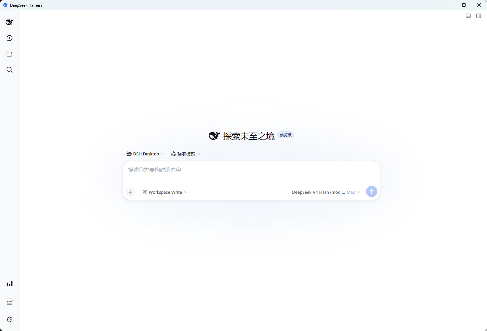
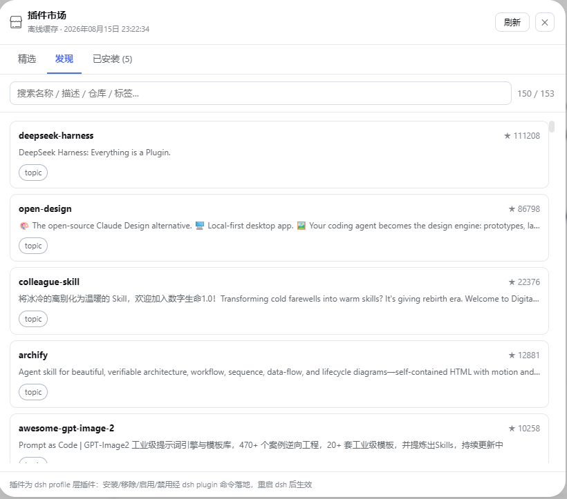
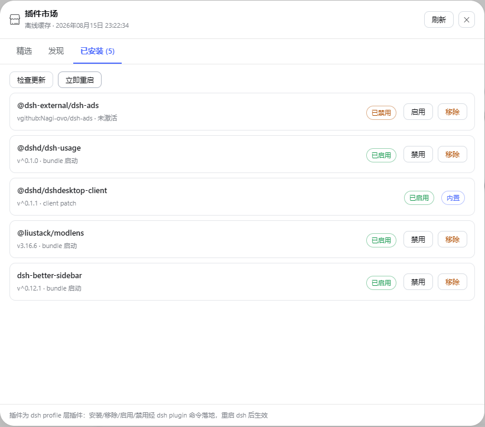
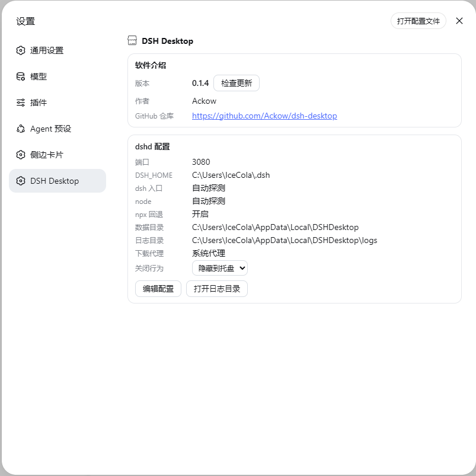

# dshdesktop-client



<p align="center">
  <strong>简体中文</strong> | <a href="README.en.md">English</a>
</p>

<p align="center">
  <strong>DSH Desktop 的官方 client 插件：把「插件市场」和「DSH Desktop 设置」装进 dsh web 侧栏。</strong><br>
  市场发现、安装、更新、启停一次搞定，配置面板与桌面端共享同一套 host bridge。
</p>
`dshdesktop-client` 通过 dsh 官方 slots 机制注入两个入口：

- 侧栏**设置按钮上方**注入「插件市场」按钮（`sidebar.footer.action`），点击打开页内市场面板；
- dsh 设置面板新增「DSH Desktop」区（`settings.section`），展示软件介绍与 dshd 配置。

所有能力通过 `chrome.webview.hostObjects.dshdesktop` 与 DSH Desktop 主窗口通信（GitHub 发现、`dsh plugin` 安装、环境/配置读写都在 host 侧完成），**浏览器侧不做特权操作**。

## 市场面板



> ⚠️ **安装功能尚不完善，敬请期待。** 当前「发现」tab 支持浏览、搜索与查看详情；安装 / 更新 / 启停等操作正在打磨中，部分插件（如 git 仓库安装、带构建脚本的包）可能无法顺利安装，建议先以官方插件（`@dshd/dshdesktop-client`、`@dshd/dsh-usage`）体验完整流程。

### 发现

- **来源**：GitHub topic 搜索（默认 `dsh-plugin` / `dsh-plugins`，配置可改）+ 社区收录目录（seed catalog），按 star 排序、去重、本地缓存（24h，断网回退缓存）
- **过滤**：只保留带 `dsh-plugin`/`dsh-plugins` topic 的仓库——宽泛 topic（如 `deepseek-harness`）搜到的非插件项目不会出现
- **搜索**：按名称 / 描述 / 仓库 / 标签实时过滤
- **详情**：仓库 / Star / License / 来源 / 信任 / 归档 + 标签；安装命令**自动从仓库 README 提取**（`dsh plugin --profile web add <pkg>`），可手动修改

### 已安装



- 列出已装插件：版本 / 激活方式（bundle 启动 / client patch）/ 启用状态
- **启用 / 禁用 / 移除**（经 `dsh plugin` 落地，重启 dsh 生效）
- **检查更新**：逐个查 npm registry 对比版本，有更新显示「有更新 vX」+ 更新按钮
- **立即重启**：杀掉旧 dsh 进程、按最新配置拉起（插件激活变更即时生效）
- 安装过程有**实时进度条**（解析依赖 → 下载 → 落盘）；关闭面板后台继续装，装完托盘气泡通知

## DSH Desktop 设置区



- **软件介绍**：版本（同行「检查更新」）、作者、GitHub 仓库链接
- **dshd 配置**：端口 / DSH_HOME / dsh 入口 / node / npx 回退 / 数据目录 / 日志目录 / 下载代理——「编辑配置」弹窗统一修改，数据目录变更**自动迁移旧数据**

## 机制与数据

- **桥接**：`chrome.webview.hostObjects.dshdesktop`（host object，须在导航前注入）；市场目录、插件生命周期、配置读写都在 host 侧
- **激活**：dsh 插件体系——声明 `dsh.bundle` 的走 `dsh.profile.bundles`，纯 `dsh.client` 走 DSH Desktop 激活 patch；**无 dsh 标记的包不激活**（dsh 拒绝加载无 `dsh.bundle` 的 bundle，会崩启动）
- **git 安装**：`github:owner/repo` 装后按包自身 `package.json` 的 `name` 识别真实包名，写入 bundles/patch 的是真实名而非 `github:` 前缀
- **下载代理**：默认直连（与终端一致）；网络受限时在配置里填代理（如 `http://127.0.0.1:7890`），经 `HTTP(S)_PROXY` 环境变量传给 pnpm

## 安装

```sh
dsh plugin --profile web add @dshd/dshdesktop-client
# 重启 dsh web 后，侧栏设置按钮上方出现「插件市场」，设置面板出现「DSH Desktop」
```

DSH Desktop 首次启动会自动安装本插件（`EntryInstaller`：装入 + 写激活 patch + 加入 `patchFiles`）。

## 开发

```sh
# 本地目录安装（跳过 npm）
mkdir -p ~/.dsh/profiles/web/node_modules/@dshd/dshdesktop-client
cp package.json index.js client.js ~/.dsh/profiles/web/node_modules/@dshd/dshdesktop-client/
# 在 ~/.dsh/profiles/web/package.json 的 dependencies 与 DSH Desktop 的激活 patch 加入 @dshd/dshdesktop-client
# 修改后重新 cp，重启 dsh web 生效
```

- `client.js` —— dsh client 插件入口（ESM，`apply`/`inject`；市场面板 + 设置区）
- `index.js` —— host 侧薄入口（无 host 逻辑，桥由桌面端注入）
- `publish.ps1` —— 一键发布到公共 npm（`npm login` 后执行）

## 配置

| 项 | 说明 | 默认 |
|---|---|---|
| `marketplaceTopics` | GitHub 发现 topic 列表 | `dsh-plugin`、`dsh-plugins` |
| `marketplaceCacheHours` | 市场缓存小时数 | `24` |
| `githubToken` | GitHub 令牌（提升限流），或 `GH_TOKEN` | — |
| `proxyUrl` | 下载代理（直连留空） | — |

## License

[MIT](LICENSE) — Copyright (c) 2026 Ackow。
